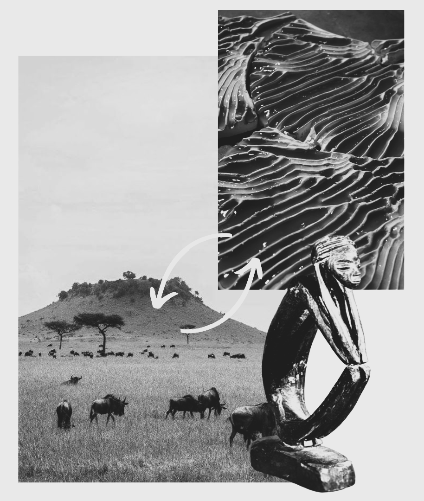
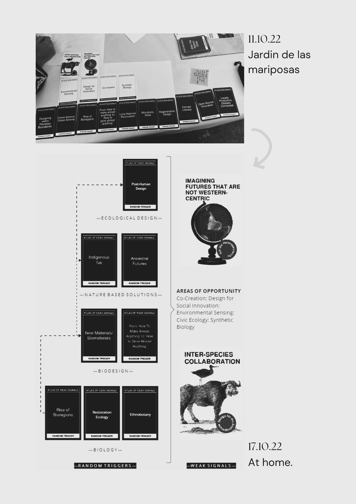

---
hide:
    - toc
---

# Design Space

> “Our relationship to land cannot heal until we learn to listen”- **Robin Wall Kimmerer
(Potawatomi author, ‘Braiding Sweetgrass’)**
>

My fight is as much about collaboration as it is about listening. It is not only diplomatic, but it is also the recipe for questioning and curiosity. That is the main reason why this week (AoWS) was so dear to me because being curious, observant and listening to the signs around us, is such a familiar atmosphere.

*Find the connections. They are trying to tell you something.*

**My two main cards are:**

1. Imagining Futures that are non-western centric

    It is about welcoming traditional knowledge, fighting for racial equality, decolonizing research, decolonizing ways of thinking, and deliberately opening space for BIPOC voices.

2. Inter-species collaboration

    It is about welcoming non-human species into our spaces. Increasing ecosystem services and biodiversity through co-habitation, Bio Design, and/or symbiotic relationships.

    **Its synergies rely on:**

    - BIPOC empowerment through nature
    - Valorization of traditional ecological knowledge
    - Digital fabrication and open-source ecological knowledge
    - Turn ecological assessments into design interventions
    - Bio Design to increase species diversity

