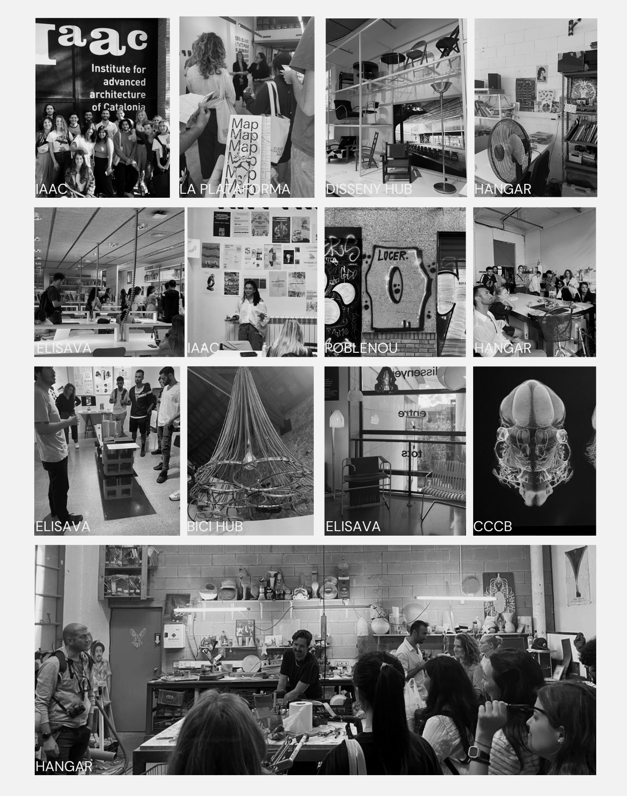

---
hide:
    - toc
---

# Map of resources
**Mapping the avaiable tools**

In these last 2 weeks, we explored the spaces and respective communities around IAAC and Poblenou. Those that related the most to my vision are included in the linked document. Because I need a digital tool that can be easily updated I have decided to create this database and every week will have new entries, with projects, associations, contacts, and/or spaces I will come to know: https://docs.google.com/spreadsheets/d/1_nlVUHvFYTKV7HbV9jh3RWcdcaP_eJOP_L2g5gmRZNk/edit?usp=sharing

Certain things are more likely to always be with me. These are things I curated to bring to Barcelona, things I found or were given to me in order to know or get to know something.
