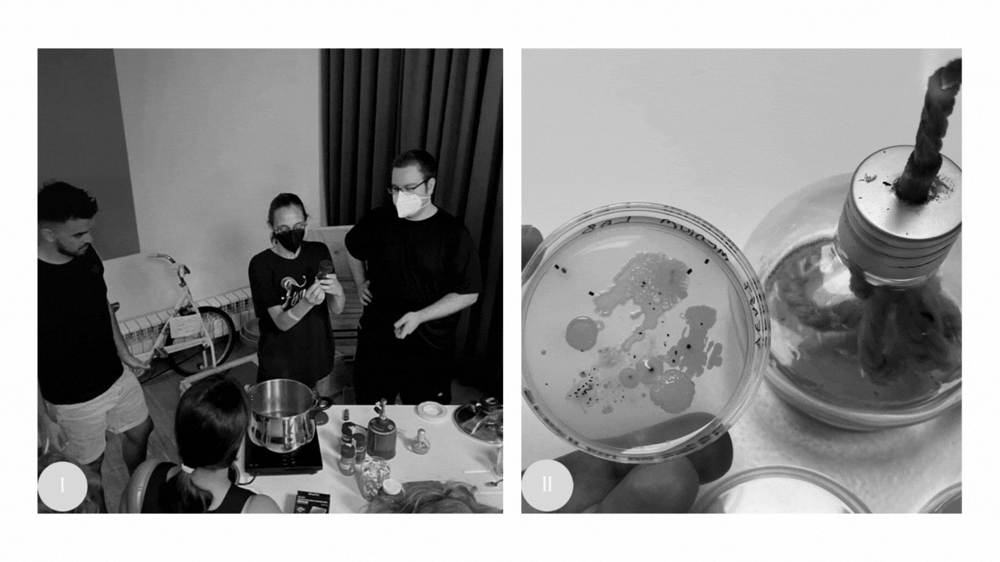

---
hide:
    - toc
---

# Bio & Agri Zero

After designing the perfect medium for different types of microorganisms we had to “hunt” them around IAAC (1). I was thinking of how I could get the most out of my medium when I found abandoned basil plants (2) casually hanging out just beside some bikes at Fablab. Sitting on top of the plant cuticle there were black dots. These are probably bug feces, and if so, they are thriving with life. I wonder what 24h in an incubator can reveal (3)…

                              [I - the vibrant environment in the improvised MDEF bio lab for the last 2 weeks; II - my favorite photo of the last 2 weeks, showcasing the vibrant environment we created for unknown microorganisms.]

My favorite photo of the week is an open petri dish with the sample I took (that I did not know what it was), under the cold incandescent light of a sterilized atmosphere. It’s my favorite because it was the first practical activity in the Bio Lab and it reminded me of how simple tools and protocols aligned with curiosity can take you into a different world within your own. It was experiences like this, that led me to science: the unknown (1) and the process of getting comfortable with it (2), yet curious enough to keep looking further (3). The chase of the unknown and the challenge keeps you in movement. Restless curiosity keeps the apathy of the world far away from you. And, once we saw the Petri boxes full of textures, reflections, colors and life, more questions popped up: How many types of organisms are on the Petri box? Were they all part of the microbiome of the bug or the basil leaf? Should I make more mediums to isolate each colony of bacteria? Do I have any of these microorganisms within me? How different am I from them? If they are the least complex out of the 3 biological domains, why do they seem so well organized? How can I contribute to their well-being? Can I ally with these beings?

Two months ago, in The New Yorker printed issue of 15th of August, Jill Lepore’s comment was published with the title: “Bringing Back the Woolly Mammoth: Americans have long understood the species’ extinction as a warning. But is trying to “de-extinct” it really a good idea?”.
Mammoths (Mammuthus sp.) were part of the megafauna of the Pleistocene. They were herbivorous mammals that inhabited big areas from cold tundra steppe, arid grasslands, to temperate savanna-parklands, thanks to paleontological records scientists were able to identify different species and morphologies that enabled Mammuthus sp. to survive in these different environments (Enk J. et al., 2016). Now, with biotechnological advancements, companies like Colossal, work to bring back mammoths to recover lost ecological functions that could mitigate climate change. The plan, as Jill wrote, is for de-extinct mammoths to “populate the permafrost and avert its melting by turning wet tundra into dry grasslands, which better sequester carbon and reflect sunlight, keeping the permafrost cooler and helping, thereby, to save the planet.”

It is important to keep the permafrost because these soil layers are often wet as well as cold, affecting oxidation/reduction, decomposition, and other biogeochemical processes. Storing organic matter underneath it since the Pleistocene (Ping C. et al., 2015). Zimov, N. S. et al. (2005) presented scenarios suggesting a rapid release of tens of kg C m2 when permafrost disappears. They also explored a solution: replacing the arid regions of Eastern Siberia (mossy forests and tundra dominated) with productive grasslands and abundant herbivorous animals. This transition could have effects on energy exchange strong enough, to reduce permafrost temperature and methane emission, allowing accumulation of tens of kg C m2. With the death of the mammoth came the extinction of a habitat: Mammoth Steppe a distinctive, now-vanished biome dominated by large mammal grazers (Wang, Y. et al., 2021) So, this is why this species is the Colossal’s first choice of de-extinction as a climate change mitigation solution, the mammoth could enable the transition from tundra to the mammoth steppe. Creative and new solutions like this become more urgent with today's climate crisis. Governments are failing us and “trends in biodiversity have been declining and are projected to continue to do so” (2020, Global Biodiversity Outlook 5). We need to keep looking for innovative ways of tackling this global issue, but is de-extinction the way to go?

This last paragraph established a “why”, yet the questions keep coming. Jill, wrote that Colossal is planning on bringing the first mammoth calves by 2025. But where? We don’t have the mammoth biome of 10.000 years ago and we will need it because once the technical hurdles of creating viable offspring of extinct animals are overcome, the species becomes a reintroduction candidate (Jørgensen D. et al.,2013). And we still do not agree on what the ultimate extinction cause of mammoths was (Lorenzen et al., 2011; Nikolskiy et al., 2011). It leaves us with more questions: Would it be a meaningful addiction to the local ecosystems? Could it regenerate the mammoth steppe or would it just worsen the condition of the current? What will the genetic pools of this mammoth population look like? Would they have evolutionary resistance? Before attempting de-extinction we should carefully access reintroduction parameters, as we cannot bring a living creature back to a non-existent habitat or one it cannot survive.

But, let’s say we do manage to have the habitat, then ultimately the success of the reintroduction would depend on their genetic arrangement and resilience to the current abiotic and biotic human-induced changes. Yet, even if Colossal manages to fill the genetic gaps in the mammoth genome it will be very difficult to secure the sustainability of a population with such little genetic material. The result would be low genetic variation within the population and increased inbreeding. There can also be undetected consequences beyond genetics for example epigenetics, behavior care or transmission of the microbiome, inputs very difficult to obtain if it was created in a biotechnological experiment or raised by other species (Robert a. et al, 2017). Unfortunately, I recognize these discontinuations as ingredients for an extinction vortex, putting the mammoth in line for its second-time extinction.

I would also like to highlight that de-extinction is a great name for marketing and getting funds as it signifies undoing extinction when in reality Colossal is attempting to create a hybrid of an Asian Elephant that has cold resistance, smaller ears, fur and a thicker layer of fat, so it can withstand the cold of the tundra and fulfill its ecological role. This is not de-extinction, this is CRISPR-Cas9 enabling genetic improvements, because in the end once the extinction line is crossed you cannot undo it.

And, this is the tip of the iceberg because I haven't even remotely touched the cultural or socioeconomic reality. One of the reasons conservation initiatives can fail is because of a lack of context, and species reintroduction is a conservation technic. The socioeconomic implications of the project have to be properly assessed as “human acceptance of reintroduction projects will be a crucial aspect to consider for de-extinction” (Jørgensen, D. et al., 2013). And even if everything from the DNA editing to the populating of the permafrost works out, there are still bioethical questions needing answers: Does Colossal own these animals? What does this mean for the Nagoya Protocol? Are we going to have mammoth hamburgers and themed parks?

As Jørgensen D. (2013) said de-extinction is not simply an intermediate between reintroduction and invasion, but much can be learned from case studies on these topics. There are issues of de-extinction that we are familiar with due to other conservation projects, but there is a dark side to the moon that we are not able to foresee. This is so innovative, some argue is parallel to the moon landing, but I agree with Jill’s comment it makes almost no sense; it’s too little, too late. It is great to entertain billionaires but as an innovative climate change solution… too late. My opinion changes when it comes to recently extinct species as, in the case of reintroductions, times between local extinction and the planned release range from a few years to a few 100 years, the levels of divergence between the environment and a de-extinct population would be less intense than the 4.000 year mammoth gap (Robert a. et al, 2017).

How we answer these questions has the potential of shaping our biomes and the earth’s surface and atmosphere, but one thing about scientists, they don’t stop in the face of adversity they thrive in these challenging environments. In the time spare, I can only hope the 75 million dollars invested in this company will help develop new scientific technics in genomics that could help us in different areas (from health to conservation).

> *“It’s a similar kind of ambitious, engineering-focused, team-based target that President Kennedy set when he declared we would put a person on the moon within a decade. The scientific challenges of this project are considerable but ultimately surmountable. The bioethical dimensions are paramount. The execution will no doubt be daunting. However, we owe it to science, to humankind, to our fellow species, and to our planet to try.”* **- George Church, 15th November 2021**
>

- **Bibliography**

    Global Biodiversity Outlook 5 (2020). Secretariat of the Convention on Biological Diversity, Montréal.

    Jørgensen, D. (2013). Reintroduction and de-extinction. BioScience, 63 (9), 719-720.

    Wang, Y., Pedersen, M. W., Alsos, I. G., De Sanctis, B., Racimo, F., Prohaska, A., ... & Willerslev, E. (2021). Late Quaternary dynamics of Arctic biota from ancient environmental genomics. Nature, 600 (7887), 86-92.

    Dehasque, M., Pečnerová, P., Muller, H., Tikhonov, A., Nikolskiy, P., Tsigankova, V. I., ... & Lister, A. M. (2021). Combining Bayesian age models and genetics to investigate population dynamics and extinction of the last mammoths in northern Siberia. Quaternary Science Reviews, 259, 106913.

    Robert, A., Thévenin, C., Princé, K., Sarrazin, F., & Clavel, J. (2017). De‐extinction and evolution. Functional Ecology, 31 (5), 1021-1031.

    Enk J, Devault A, Widga C, Saunders J, Szpak P, Southon J, Rouillard J-M, Shapiro B, Golding GB, Zazula G, Froese D, Fisher DC, MacPhee RDE and Poinar H (2016) Mammuthus Population Dynamics in Late Pleistocene North America: Divergence, Phylogeography, and Introgression. Front. Ecol. Evol. 4:42. doi: 10.3389/fevo.2016.00042

    Ping, C. L., Jastrow, J. D., Jorgenson, M. T., Michaelson, G. J., & Shur, Y. L. (2015). Permafrost soils and carbon cycling. Soil, 1(1), 147-171.

    Zimov, N. S., Zimov, S. A., Zimova, A. E., Zimova, G. M., Chuprynin, V. I., & Chapin III, F. S. (2009). Carbon storage in permafrost and soils of the mammoth tundra‐steppe biome: Role in the global carbon budget. Geophysical Research Letters, 36(2).
