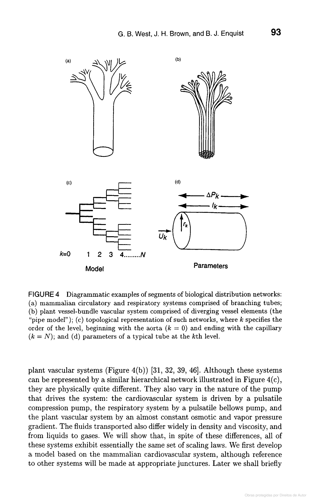

---
hide:
    - toc
---

# Bio & Agri Zero

Nuria took us on a journey of biological scale and complex systems, building a strong basis of scientific understanding of the universe. In alliance with critical thinking and the scientific method, we have constructed the necessary pillars to kickstart biohacking the world.

---

This week was filled with information (heavy) but it leveled the plane when it comes to the biological knowledge of the group. Because the interventions were information dense I will highlight those that opened paths to other interesting research topics.

**1 - Life on Earth**

Life is carbon-based. The first major transition was the leap from the molecular scale to the microbiology scale, this scaling up continues to form complex systems and communication networks until it took us into the realm of cultural evolution (designers normally operate here). At this point, *Homo sapiens* have been the most prominent agents of change on the Earth’s surface, making our way into the name of the Epoch: Anthropocene.

**1.1 - After the trigger of “Life on Earth”**

Complex systems were introduced by Nuria through Aristotle's quote: "The whole is more than the sum of its parts”. A few days before this class, Paige (one of our colleagues) recommended me an Invisibilia podcast episode about biological scales and it adds a new branch to this idea of complex systems, that as a self-proclaimed cross-pollinator, can be very helpful in developing new approaches to design.

*The image represents side by side a scale in meters and the respective areas of knowledge. These worlds are all connected and full of opportunities they are just operating on different scales.*

**"Even though these systems are so different they exhibit essentially the same set of scaling laws.”** 
<iframe frameborder="0" scrolling="no" style="border:0px" src="https://books.google.es/books?id=3OwpPgGv29UC&lpg=PA7&hl=pt-PT&pg=PA93&output=embed" width=500 height=500></iframe>

Humans are great at intra-specific design, in reality, is a design bias - the human perspective - so understanding non-human systems takes us out of a comfort bubble. We have been operating only at our scale excluding access to other forms of life. Being aware that we are operating on different scales, might just be the first step. That is where empathy and inter-species collaboration comes in.
