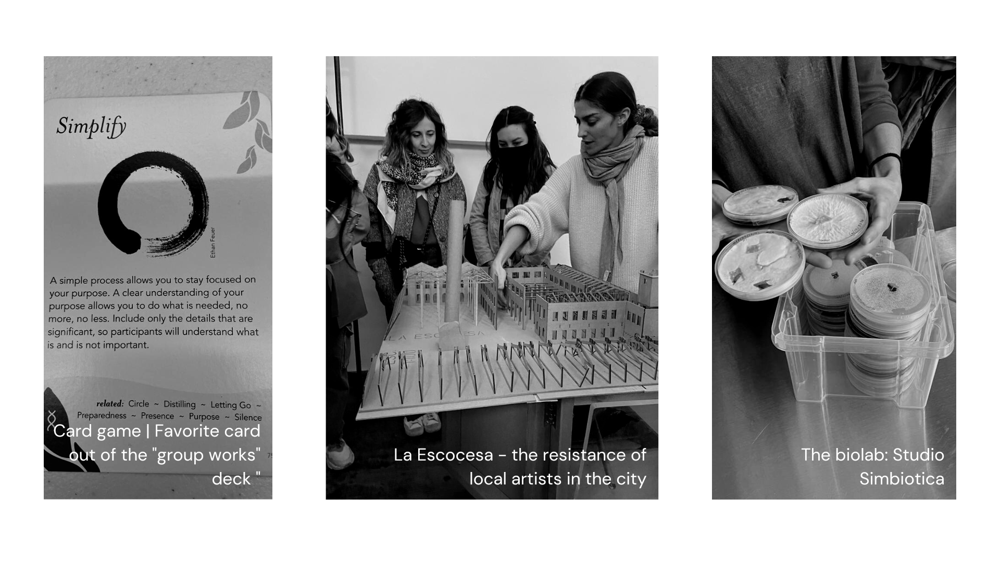

---
hide:
    - toc
---

# Community Engagement

> “Not everything that is faced can be changed, but nothing can be changed until it is faced.” —**James Baldwin**
>

The community engagement week was intense. I learned so much from all the communities we came in contact with as well from reminiscing on past experiences and my connection with the African diaspora. It was also a great way to reflect on spaces where this unity is lacking and how we ignite the facilitator role.

**Key-words:** Community, Engagement, Listening, Power, Invisibility, Inequality, Diversity, Representation, Mapping, Togetherness, Action, Money, Power, Facilitating, Conflict Management, Futures Literacy.

**Community** **Mapping**

If Biology only makes sense in the light of evolution, Community mapping only makes sense under the perspective of Complex Systems. That is exactly what we practised with Markel with the united kigdom map of the obesity problem that included a great number of factors, from transportation systems and infrastructure to psychological factors.

**Power Dynamics**

When talking about community, as oneness and togetherness, it feels like we have set an intention of acting towards a greater good. Yes, you can recycle, compost, go vegan, or zero-waste but to do so embedded in a community is empowering and establishes stronger bonds - a blueprint for societal change. There is power in numbers. This takes us to what was tackled later in the week: power. I believe I have power but most of the time I am unaware of how much. After coming across the following papers: 1) “The P-Word: Power aversion and responsibility aversion as explanations for the avoidance of power”; 2) "Who Wants to Get to the Top? Class and Lay Theories About Power”, my view on power changed as I realized that my background (mixed race woman and raised in a family of immigrants), values and principles constrained my views, search and the notion of power. In summary, these papers speak about how some communities, especially those on the margins of society, do not actively search for positions of power and even avoided it, by thinking it is inherently negative (something I related to). So why do individuals from lower classes don't seek power as avidly as higher class individuals?

- Low class individuals are less interested in seeking positions of power using political means, and as a result less interested in seeking positions of power more broadly;
- They perceive that for advancement you need to play politics, so they then fail to pursue advancement and further contribute to their low status;
- There is inner conflict, lower class individuals tend to focus on the community more than on themselves clashing with some concepts of pursuing positions of power in politics;

But there are two particular situations where low class individuals are as interested in acquiring positions of power as individuals from higher classes: “when advancement comes explicitly from prosocial means rather than from political means and to some extent when they frame power as a superordinate other-focused goal”.

It highlights how difficult but how necessary it is to have class-based diversity within power positions. The community-driven professional goals of BIPOC folks are well represented in this example given by Neil deGrasse (Astrophysicist) when one of his (black) friends says: “Astrophysics? The black community cannot afford the luxury of someone of your intellect to spend it on that subject.” Making him feel guilty about not doing enough to help others. You can watch the full video here: [A Story About Race Neil deGrasse Tyson - YouTube](https://www.youtube.com/watch?v=eQLtPWPqsjA). Not to say that every BIPOC struggle is due our conception of power, it is much more complex, but it is freeing to detach evilness from power and move forward without that guilt.

**Representation and Diversity**

Just like sustainability, these words are thrown around every day. But what does it mean to have representation and diversity within a group of people? It means to consciously open space to those who have been marginalized by society (at different levels), it’s creating equal opportunities through equity,... And there is the need to actively do so! We have to be intentional in opening these spaces because historically, for centuries, there were intentional acts of discrimination that led to generational consequences, keeping these groups under the tight and inhumane grip of exploitation, translating into a societal system that has roots in colonization, capitalism, and ecological destruction. Also, it is a fact that diversity is a driver of innovation, creativity, and productivity. The “why” is settled, but “how” is the million dollar question. I was the 1 black student in 300 students at my Bachelor’s in Biology (Faculty of Sciences of the University of Lisbon). If, any of the professors opened a job/intern opportunity no matter how inclusive they would like to be the chances of that person being BIPOC was 1/300. There is so much resistance in the current system to open space to unprivileged and marginalized groups in higher education. So, clearly, something happens before college because 1/300 it is not representative of the BIPOC population interested in life sciences (Lisbon - Portugal), and I believe that institutions that produce new knowledge and are aiming to lead a new generation of free thinkers must have this subject as one of their higher priorities: the inclusion of BIPOC, Queer and LGBTQ+, People with disabilities, cognitive and background diversity.

Design can be hopeful and open doors to new realities that nos-western centric: [Diébédo Francis Kéré: How to build with clay... and community - YouTube](https://www.youtube.com/watch?v=MD23gIlr52Y)

**Futures Literacy**

What a privilege it is to have this Future perspectives, possibilities and realities colliding and even to develop foresight skills as the majority awakes to the threats of the socio-ecological crisis, a feeling of despair that is so familiar to Indigenous, Queer and many diaspora communities around the world. When researching about community I was trying to search for resources that were non-western centered, when something came up called: **Futures Literacy (FL)**, something I have never heard of but has been around since the beginning of this century. FL is rooted in the notions of “using-the-future”. “The  future  does  not  exist in the present but anticipation does. The form the future takes in the present is anticipation.” Using the cross-over of theory and practise of Anticipation Systems (AS), the future is integrated in the present, and that happens constantly trough out our daily-life having the potential of helping us overturn into new frames of mind.

For example:

*Efforts to recognise and preserve cultural heritage, in all its forms, are fundamentally linked to views of the past, present and future. As a result, the anticipatory assumptions that form the foundation for imagining the future play a determinant role in understanding what cultural heritage is, which aspects are deemed worth preserving and how to attempt to assure durability or continuity.*

I am interest in researching more on **FL to redeem colonization** and **Bayo Akomolafe**, the writer and founder of **The Emergence Network in Nigeria**, has some great thoughts on this topic “Colonisation was really about homogenization and mass production. It was also about the sterilization of hope, the failure of imagination, and the condensation of the manifold to a single story.” There are more stories and futures beyond the captalist, colonizer and industrial imposed ones under the (still) suffocating systems of opression, there are futures that look like community, unity, abundance, diversity, are welcoming and freeing. Those emerging possibilities are the ones I am fighting for.

**Facilitating**

To be a facilitator is a role of great responsibility. It is the role of a active listener, mediator, curator, communicator, time-manager, open-minded and at the center of everything a great facilitator is a channel of love and tolerance for that particular group.

This word was introduced to the class attached to another concept: **Social Capital**. **** As we are all part of a group in relation to something else. That lead us to the final exercise of week where we embodied a system to better understand it. This is when Mérce introduced us to Embodied Theatre.

**No (self) judgement and meritocracy**

With the time I spent in Scientific institutions there was the underlying discussion of what is excellence. Excellence as always been viewed as an ally to scientific innovation, but is it really? This is currently a hot topic in scientific institutions. I came across this AEON article that exposes the following thoughts:

- rather than excellence a team of people should bring diverse knowledge bases, tools and analytic skills to the table
- Optimal hiring depends on context - “given a specific task and the composition of a particular team, one  would be more likely to contribute than another”

‘Having people who have different mental perspectives is what’s important. If you want to explore things you haven’t explored, having people who look just like you and think just like you is not the best way.’ - Astro Teller, CEO of X - “moonshoot factory”

Mentioned article**:** [Why hiring the best people produces the least creative results](https://aeon.co/ideas/why-hiring-the-best-people-produces-the-least-creative-results)

***But what happens when you have the role of facilitator within an environment that places you in contact with something more-than-human?***

As we moved into the assignments related to Design Dialogues this particular theme shined the brighter and reminded me of what Ron Wakkary said during his lecture: *“It’s impossible to be inclusionary but it is possible to be tentacular and collective in our design.”* Since then together with a group (at the time) called Augmented Reality - Myrto, Stella, Paige, Mariana and I - decided to join forces to bring in orther to explore the following question: How to facilitate interactions with something that is more-than-human?

(The later work is further developed in the *Design Dialogues I* section)
