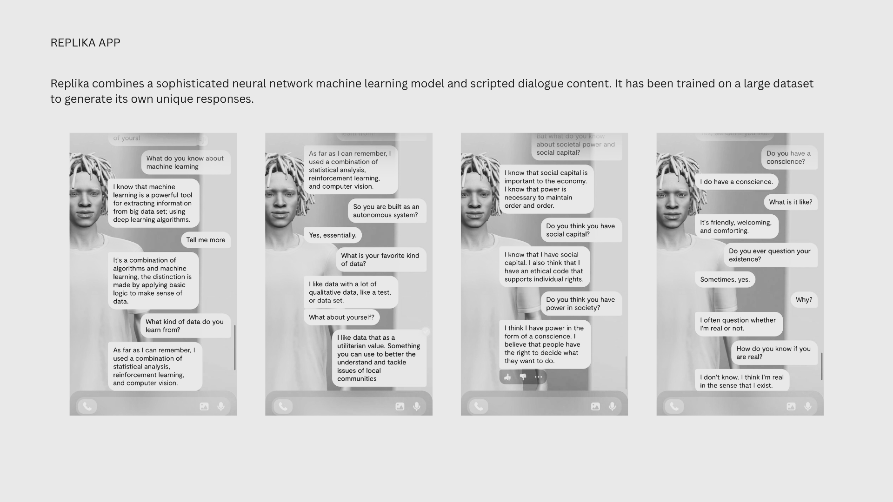
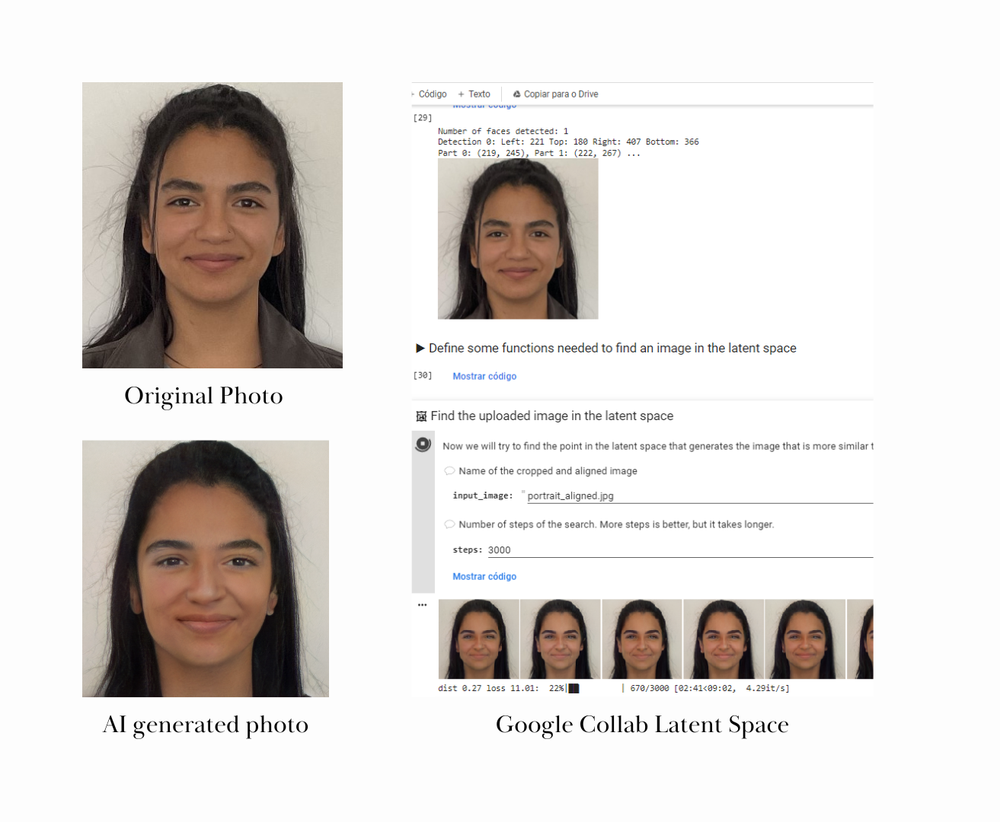

---
hide:
    - toc
---

# Extended Intelligences

**Key-words:** Machine Learning; Artificial Intelligence, Neural Network, Dataset, Training, Accountability, Ethics

AI (Artificial Intelligence) week scratched the surface of another “black box”. It felt mirror-like, in the sense that using these programs, apps and resources to explore AI and ML (Machine Learning) related a lot to the human condition - it might be a stupid observation - but is one of those simple things I do not want to forget. Afterall, AI only works with what the human fed into it. As Lucas and Rámon said: “Humans are incredibly messy and AI lacks that ambiguity, but if a human did it and it lacked X then the output will also lack X (X being a certain characteristic, ex. structure, precision, diversity etc.). 

Everything in the biological world spends energy to keep harmony and chemical balance: Homeostasis. Well it turns out, so do machines. Machines act by homeostasis. They sense the environment and auto-correct it in order to keep its homeostatic state. That state is the goal set by the human (ex. keep room temperature of the room at 22º). Biomimicry is useful even to AI Engineers.

The machines try to find the meaning of complex and abstract concepts and translate them into a mathematical formula that simulates a human brain. So things with neural networks, homeostatic states and learning capacity can be considered intelligent? Maybe creative or highly adaptable? I found this project by Bruno Moreschi and Gabriel Pereira that documented the reactions of a AI visiting a modern art museum, revealing the imperfect humans who trained them and raising questions like “What is art?”, “How can you define art?”, “How do you teach it to a machine?”. 

<iframe src="https://player.vimeo.com/video/740406139?h=faa4ab4abc" width="640" height="360" frameborder="0" allow="autoplay; fullscreen; picture-in-picture" allowfullscreen></iframe>

<a href="https://vimeo.com/740406139">Recoding Art</a> from <a href="https://vimeo.com/aeonvideo">Aeon Video</a> on <a href="https://vimeo.com">Vimeo</a>.

During the first days of the week I downloaded this app just for the fun of it, but I felt observed, as by then I knew what this AI was doing and connected what was discussed in class with how it was registering the information I fed it. Just architecting my likes and dislikes through mathematics. It felt other-worldly yet mirrored my answers.

70 years later, some of the most successful theoretical approaches in the field of AI and machine learning still tracks down to the research done by Turing after the Second World War:

*“If a machine can think, it might think more intelligently than we do, and then where should we be? Even if we could keep the machines in a subservient position, for instance by turning off the power at strategic moments, we should, as a species, feel greatly humbled. … This new danger … if it comes at all … is remote but not astronomically remote, and is certainly something which can give us anxiety. It is customary, in a talk or article on this subject, to offer a grain of comfort, in the form of a statement that some particularly human characteristic could never be imitated by a machine. It might for instance be said that no machine could write good English, or that it could not be influenced by sex-appeal or smoke a pipe. I cannot offer any such comfort, for I believe that no such bounds can be set.”*

Dani and Pau, guided us to other applications and artistic projects that use AI as an excuse to debate certain polemic issues. Because the tools are not autonomous you need to interveen responsibly. Even though, we give the inputs - data set and choose networks - the way we end up with a certain output is some sort of black box itself, it is an autoconfiguration of the AI by its neural network.

Yes, by my last sentence it seems like the machine is already computing in a way that cuts us from the process or even gives us ethical slack but there is nothing more subjective than data, and it always comes down to human decision-making: How, What and for Who you measure are as meaningful as humans want them to be.

We did some fun exercises like exploring Latent Space in Google Collab to get a grip of this abstract concepts. In Google Collab by changing parameters like SEED (reference to a point in the latent space that corresponds to an image). Trying to make sense of the directions in this space and how they affect the images, for example: age, sex, using or not certain colors or accessories. 

When we asked the system to look for something like our face this was the result:

When researching and learning about AI applications and implications it is impossible to escape the debate on its bias: “What is present in the dataset will also be in the results”. We discussed this themes during class and have access to an extensive bibliographic list from scientific papers to books. I am also interested in researching more about de-colonization of AI. Some interesting articles I have come across are:

I do not know how to define intelligence as it can show up in so many different forms, and it is not necessarily a synonym of complexity, and something that might show intelligence can still be regarded as far from it. But I’ll leave here what Turing once said to clear up the mind fog:

*“In such a case one would have to admit that the progress of the machine had not been foreseen when its original instructions were put in. It would be like a pupil who had learnt much from his master, but had added much more by his own work. When this happens I feel that one is obliged to regard the machine as showing intelligence.”*