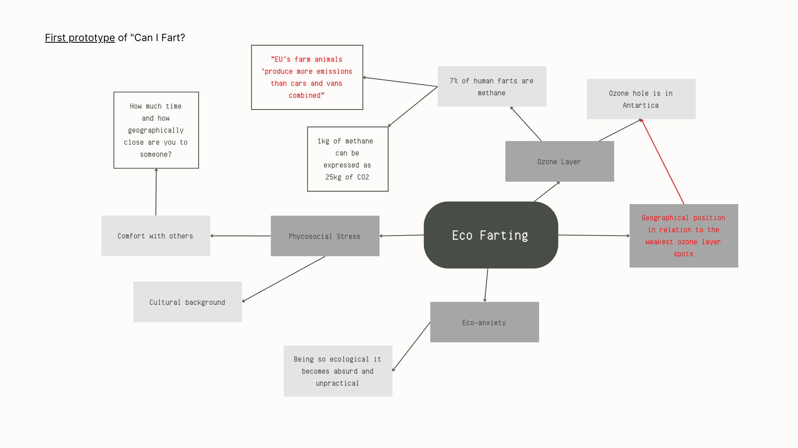

---
hide:
    - toc
---

# Extended Intelligences

In order to further explore AI possibilities and understand its repercussions we were divided in groups to create and discuss the implications of an “AI Thing”. An excuse to debate and ground our knowledge on the main concepts surrounding AI and ML.

Our group had a hard time finding common ground so we went for the silly and fun. We decided we were going to make a ridiculous and absurd AI on farts (Yes, we developed a project on flatulence).

