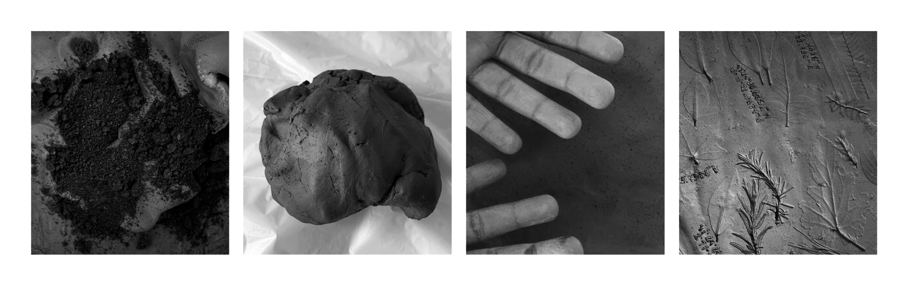

---
hide:
    - toc
---

# Living With Your Ideas

For living with your own ideas week I wanted to materialize my design space as I had never tried to bring the world of ideas into the present. By looking at the design space I’ve been creating, I noticed this subconscious interest in clay and natural materials that can potentially bridge or fill gaps in nature-deprived urban landscapes. I started exploring myself and my surrounding as bioreceptive environments and how I could bring that to fruition for 24h. I bought natural clay. Picked leaves from nearby trees and bushes. And got to know the flora of my neighborhood without relying on taxonomy, just feeling textures, shapes and registering their locations in hopes I could document without losing the bond I created when researching *in situ*.

Being grounded in the present and involved led me to notice how birds' and insects' locations didn't always intersect. And, to my own amazement different locations had different sets of plants! I pass by these plants every day and did not realize someone had put some thought into them. The playground had leaves with larger surface areas (shadow), the diagonal to Glóries had plants with small leaves and trichomes (more resistant to pollution and drought), near spaces with benches you could find bushes with blooming flowers (pleasent sights), …

I didn't wear gloves to pick the leaves and some had spikes, trichomes (microscopic hairs), flowers, sharpness, softness, and thickness. By choosing to decal the leaves into clay, the shape and textures of the leaves can be felt with detail. An excel sheet, photo, or VR software would lack this information. I had never thought about this lack before. How could we make this information available to people? How important are these inputs when it comes to raising conservation awareness? What if people could feel the skin of a white rhino, would that change their actions? To what extent the global consciousness of the natural world would change? Could it be a crucial piece in establishing rights for non-human species with the same depth that we have for the Homo sapiens?

**Moving away from the excel sheet, at least just for a moment.**

When you involve yourself you are more empathetic, materialist, visceral, and aware. Resulting in actions that do not come from volatile thoughts or quantitative data, but from solid sensations. The smell of clay, the touch of spikes, the sound of insects, the colors of flowers, etc. all of that contributed to the realization that 1PP is valuable because it enriches research with human senses and humane actions. With the 1PP design, it felt more purpose-driven. I do think I am still very much a Prototype Role 1 kind of designer but I will definitely incorporate a 1PP as valuable input.

**Why add coffee?**

By adding coffee grounds (waste) to the clay the porosity of the material is increased. This might be helpful for certain ecological artifacts, ex. ollas. So I took this opportunity to try and incorporate this element into natural clay as another physical experiment inspired by my digital design space.

1. collect coffee grounds (from 2 french presses)
2. dry the collected coffee grounds (microwaved for 2min.)
3. incorporate into the clay
4. add the necessary water

This idea was inspired by the following study: Manni, A., El Haddar, A., El Hassani, I. E. E. A., El Bouari, A., & Sadik, C. (2019). *Valorization of coffee waste with Moroccan clay to produce a porous red ceramics* (class BIII). Boletín de la Sociedad Española de Cerámica y Vidrio, 58 (5), 211-220.

**Next Steps…**

From this exercise I could derivate 2 more activities:

- I want to share the clay tablet with kids in the playground, interact and see how they respond (I want to interfere as little as possible, at least in the beginning, even if it means the end of the clay tablet).
- Because I want to get as much as I can from these leaves, I will do a cyanotype print for some of the leaves (it is also a way to protect the documentation, if the kids in the playground destroy the clay tablet)
