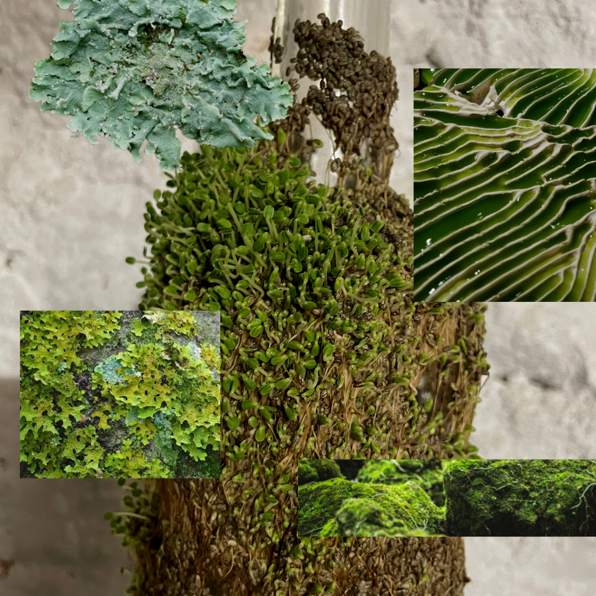

---
hide:
    - toc
---

# Remixing materials

**Assignement 1st week of Remixing Materials**

*Properties (functional, technical & emotional)*
- Functional: structural, light, brown, dry, stiff.
- Technical: Eatable, compostable, biodegradable, fibrous.
(I could not find references of people that used squash or pumpkin seeds as a biomaterial. Yet, there are a few references that tried to incorporate the seeds into food products like cereal bars.)
- Emotional: humble, curious, novel, ancient, multifaceted.

*Describe what is it and its aspect/aesthetic (add photo to documentation)*
These are squash seeds from the last year’s materials library as the material I brought was still fresh and wet from the sterilization in boiling water (pea-pods). The squash seeds were ready to use. Amanda and I were a group and the material felt beginners friendly and aesthetically pleasing, as we moved from experiment to experiment the squash seeds remained as our additive and connected every exploration of the first day of Remixing Materials.

*What is the story behind them (who did them, why, where it comes from)*
It is a mystery how those seeds got to the flask, at the MDEF’s Biomaterial Library. But I suppose they could have come from a supermarket, local market, or community garden, among other possibilities. Historically, the squash family was of easy hybridization, widely used and appreciated by native Americans and brought to Europe during the 16th century.

*2 possible applications for each*
Initially, I saw the potential for it to be used in 3D printers to make printed cookies (eatable) and used for 3D printing prototyping purposes. After it dried it became very brittle so maybe it could be incorporated into recipes as a nutritional additive or pet biscuits.

*Properties (functional, technical & emotional)*
- Functional: growth, interspecies relations
- Technical: fluffy, squishy, moldy, colorful,
- Emotional: feminine, multicultural, eclectic, electric

*Describe what is it and its aspect/aesthetic (add photo to documentation)*
This material could be described as multicultural, plural, interspecific and colorful. Even though I am drawn the most to mycelium and coffee as materials, this exploration by Dasha Plesen really spoke to me in the way it welcomes playfulness and such different species, creating an ecosystem of colors, sensations and ways of knowing that are more than human.

*What is the story behind them (who did them, why, where it comes from)*
It is unknown. But the thing about microorganisms is that they are everywhere and are in everything. To isolate them and use them as a material feels natural and revolutionary.

*2 possible applications for each*
- Art through interspecies collaboration.
- Apply it as a bioink or biopattern

*Properties (functional, technical & emotional)*
- Functional: regenerative
- Technical: malleable, biodegradable and compostable
- Emotional: holistic and sensorial rich

*Describe what is it and their aspect/aesthetic - To better translate my vision of my ideal material I made a mood board.*

*What is the story behind them (who did them, why, where it comes from)*
This ideal material would be of natural origin and can be discarded without harming the life on planet Earth. Because its existence is the result of a natural process of evolution and natural selection.

*2 possible applications for each*
- Enhances the bioreceptive characteristics of a place or building
- Its texture is useful for the textile and fashion industries