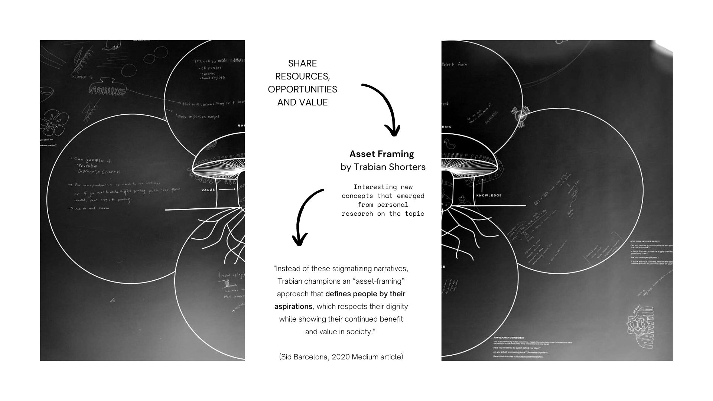
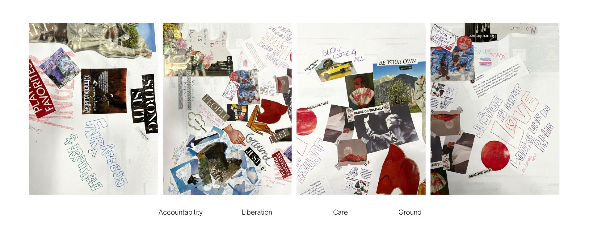

---
hide:
    - toc
---

# Distributed Design

**Reflections on the exercises of this week**

***Reflection on the 12/04 - Mushroom Model***

**Learning Skills**
*Skills that can be translated into something useful.*

The Mushroom Model was a novel concept for me, as I was reluctant to start, but I now understand its usefulness in mapping supply chains. I also learned that simple objects can have a deep cultural history, and their existence relies on the evolution and iterating their design to stay relevant and useful over time, as well as the cultural stories built around them. 

**Dynamics**
*How was the dynamic inside the group?*

Our group randomly selected the hair clip as the object to track, and while we were initially skeptical about its relevance, we eventually saw the value in brainstorming the impacts of this item in a more organized way trough this new model. We gained a lot of knowledge about this daily object, including its impact on climate, social status, professional occupation, hair length, and cultural significance.

**Interactions**
*Did the role I played influenced my opinion, in other words, how my bias influenced my positioning*

I do think my role played an influence during the exercise. Firstly, I am human and by default highly biased. I was reluctant to start thinking about a hair clip and how that could help in any way my projects and interventions, but as I mentioned before there is something valuable in learning how to structure your brainstorms, specially when you have to map so much and in detail, it helps you start to think and act upon the subject at hands without getting too overwhelmed. I also found it helpful to move from overthinking into knowing, from data online and information into actionable and utilitarian knowledge within the supply chain. 

<iframe width="560" height="315" src="https://www.youtube.com/embed/O04CuqStRvM" title="YouTube video player" frameborder="0" allow="accelerometer; autoplay; clipboard-write; encrypted-media; gyroscope; picture-in-picture; web-share" allowfullscreen></iframe>

After a couple days I found a new concept by Trabian Shorters - Asset Framing, that relates to the creation of value and its distribution. Interesting how the way we adress a certain subject can have such deep consequences when it comes to its value in society, especially when we are talking about marginalized folks.

***Reflection on the 13/04 - Reflection Tree***

**Learning Skills**
*Skills that can be translated into something useful?*

I found the Reflection Tree exercise to be more useful and interesting than the Mushroom Model. It allowed me to work at my own pace and focus on a project that I am passionate about - Interspecies Tarot. The structure of the activity was also well-designed, with opportunities to work on our own projects, discuss and share findings with the group, share with other groups, and embody our ideas. The embodiment aspect was especially enjoyable, as it got us moving and loosened us up. As someone who is not from a design background, this exercise was a great addition to my personal toolkit.

**Dynamics**
*How was the dynamic inside the group?*

Compared to the Mushroom Model exercise, the Reflection Tree was more successful in our group, with more opportunities to get inspired and diverse exercises within the activity. The idea of taking the exercise to the terrace was also wonderful, as it helped engage the group.

**Interactions**
*Did the role I played influenced my opinion, in other words, how my bias influenced my positioning*

As half of the activity was centered around our own personal projects, when we came together to discuss our takes on the exercise, we guided each other through the values of Distributed Design and openly shared our interpretations and applications to our individual projects. I'm sure I influenced my group to some extent, but everyone had valuable input that helped balance our biases. Additionally, we had very similar ideas and desires for the impact we wanted our projects to have. Our intentions were well alligned.

***Reflection on the 14/04 - Final Presentation***

**Learning Skills**
*Skills that can be translated into something useful?*

**Dynamics**
*How was the dynamic inside the group?*

**Interactions**
*Did the role I played influenced my opinion, in other words, how my bias influenced my positioning*