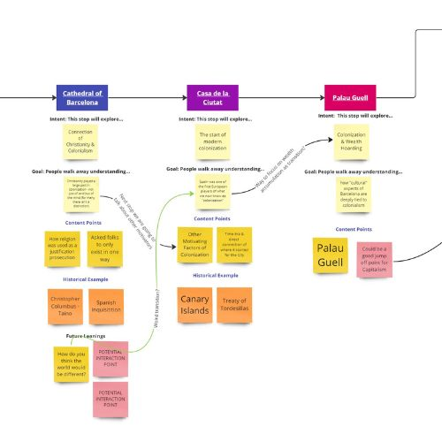

---
hide:
    - toc
---

# Digital Prototyping for Design - Challenge II

***Last MicroChallenge: Human Interfaces***

This was our last FabLab challenge within the MDEF program. Now, reflecting on the incredible journey of the MOC we had to take a different path than the majority of the class when it came to technology when creating a Human Interface for our project. We went low-tech for the interface. It has been a challenging yet rewarding experience.

As we embarked on this last challenge, we were guided by three key considerations that would shape our approach and optimize our efforts. The first was the feedback we received from the MOC Tour during the MDEF Festival. Through this experience, we gained valuable insights from the participants. They emphasized the importance of using historical facts to discuss current systems of oppression—a powerful way to create awareness and inspire change. We also recognized the need for a more hands-on, engaging, and interactive approach to enhance the tour experience. Additionally, we took into account the participants' feedback regarding the walking distance to the Gato de Botero (for example), where we addressed immigration issues, and acknowledged that it might be too long for some. These insights became the foundation of our future planning.

Becuase we are already engaged in a collaboration with [Explorins](https://www.explorins.com/home), an organization specializing in interactive phygital experiences, new possibilities and resources were brought up, that we eagerly embraced. Working closely with EXPLORINS, we developed a map of the MOC on their platform.

Inclusivity and funding were significant aspects of the future of our project. We wanted to make the project more appealing to BIPOC individuals and sought to involve 3D artists through a call for artwork contributions and a in person workshop, to maybe turn ceramic pieces into 3D objects. This ios all things we are considering together with Angela and Pol form the Explorins team and something we could not fit into a weeks work but rather a long term. The MOC for us is a marathon and no longer a 9 month race. Our collaboration with EXPLORINS and our dedicated efforts to secure funding would ensure that the project is extended beyond our graduation—a prospect that excited and motivated us greatly. 

On the second day, after reavaluating our goals and timelines, we made significant progress by analyzing our existing tour and translating it into the Explorins platform. The map we created symbolizes a milestone achieved. 

With the map uploaded (but not yet online for general public) we turned our focus towards enhancing the fun and interactive elements of the tour. We encountered challenges with the MOC prototypes, such as the stamp button and ticket machine, as they were still in early development and not suitable for the Festival tour. In light of this, we decided to adopt a low-tech approach and create a sticker book. This book would serve as a personal space for individuals to record their thoughts, notes, and feelings—a tangible and individualized way for them to engage with the tour and leave their own mark. We dedicated time to perfecting the cover of the sticker book, experimenting with different techniques to achieve a marble acrylic paint effect. 

Within the pages of the sticker book, we aim to create a thought-provoking and enjoyable experience. Gentle prompts, interesting facts, and playful stickers invite participants to delve into their thoughts and explore their inner world while they participate on the MOC tour around Barcelona. It is a space where meaningful dialogue can emerge, fostering connections and understanding.

As I look ahead, I can't help but feel a mix of excitement and nervousness. The next steps of the MOC project are crucial, and our dedication and hard work have brought us to this point. We are determined to challenge colonial thought, inspire dialogue, and foster a more inclusive and equitable society. The path ahead is filled with uncertainty and with the upcoming Festival we really wanted to use this week to push the conceptual part of MOC and start working on the two events we will host: A MOC Kick-Of and the Tour around Barcelona’s colonial history.