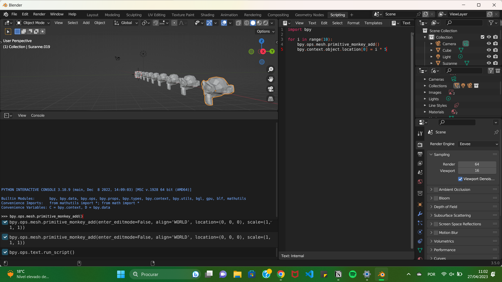

---
hide:
    - toc
---

# Prototype for Design II

***First task: Simulate robot movement on Rhino***

Today was Robot day! Josep guided us trough the basics of using robotic arms. It was a lot of new information. At FabLab/IAAC we are working with robots with 6 axis, something you can normally tell by just looking at the number of joints. These robots can do almost anything, a particular advantage of using them as CNCs is the fact that they can mill with an angle, contrary to the CNC machines. After we got some basics down we moved on to the practical exercise. The class got to use the arm manually, using a controller, to fulfill a small task: lift the roll of tape on top of a cardboard box and put it back down :D

To automate a process using a robot like ABB 140, the user must do it with the Rhino and Grasshopper software. I had never used Grasshopper before. Sami, Josephine, Wen, and I set aside some time to tackle this task. By following the steps on the MDEF - FabLab website, we were able to complete the task and simulate a movement with the robotic arm at IAAC.

***Second task: Get to know Blender as Interface***
During Victor's class, we were introduced to an exciting new world: Blender as an interface. Blender is a powerful, open-source software that allows creative people to create amazing 3D animations without the constraints of shareholders, ownership, or a capitalistic focus on growth and profit.

Ton Roosendaal, the founder of Blender, is a fascinating and funny individual. In his 2022 Blender Conference introduction, he discussed the crises facing humanity in the coming years, and how that involves for example, human interfaces, especially 3D softwares as the building blocks of those alternative worlds (ex. meta verse and AI 🥲)
<iframe width="560" height="315" src="https://www.youtube.com/embed/gsGkvF5-i-I" title="YouTube video player" frameborder="0" allow="accelerometer; autoplay; clipboard-write; encrypted-media; gyroscope; picture-in-picture; web-share" allowfullscreen></iframe>

In order to use blender you have to be quite patient as it is not as intuitive as other softwares, at least those i am more used to. Victor gave us some helpful tips on how to use phyton to better manipulate Blender and master this software. This was quite an intense class, hard to grasp, despite the challenges of using Blender, I would like to become proficient enough to create small animations, but first I have to prioritize other projects that are at the moment more alligned with want I would like to develop 🥰

***Third task: Get to know Live coding as a human interface***