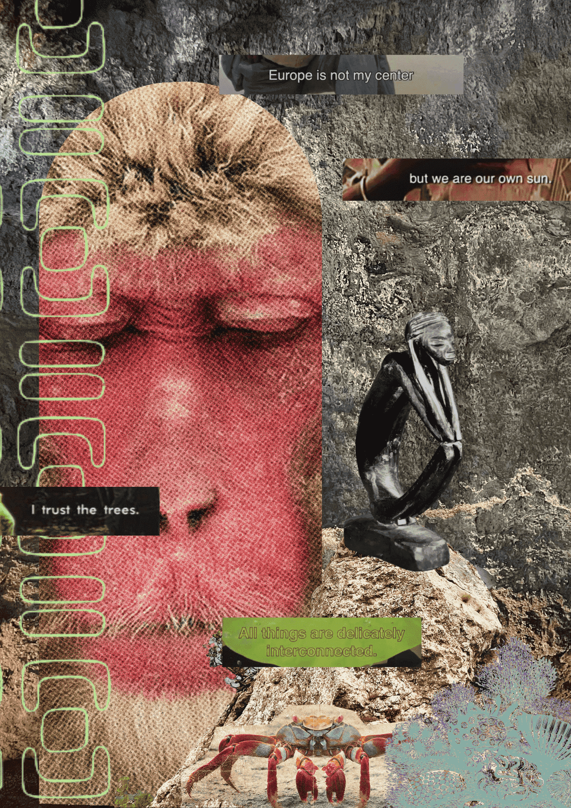

---
hide:
    - toc
---

# Design Studio III
***The page dedicated to Design Studio tasks***

# Kick off - Framing your first Design Intervention for Term III

The MOC first Design Intervention of the trimester will be a tour. The team, at some point, mentioned it as a possible intervention for the third trimester, but it became more of a feasible and viable idea once Magda (from Futurity Systems and MDEF alumni) and Mariana Quintero mentioned and brainstormed this idea with us during the Design Dialogues!

So, that's what we did in the following weeks we researched, discussed, brainstormed, and developed a tour - all in theory. The Tour will focus onm the colonial history of Barcelona that is not mentioned on History Books. The next step will be for us to try it out. We also want to record what we say, almost like a podcast. We'll see how it goes... Marielle's parents are also coming in the middle of the trimester, so we can have a larger audience to provide feedback on our first MOC Tour!

# Alternative presents to emergent futures - Understating your emerging profiles and roles.

I have been fortunate to learn from a diverse range of sources who have instilled in me the realization that individual design is no longer sufficient. We are intricately connected to the broader web of our world. I humbly acknowledge that I am not an expert in all things but I care for them, I care about everything, because I care about somethings and thus things are not isolated. Collaboration, cross-disciplinary approaches, and collective embodiment are essential for addressing the complexities we face. I firmly embrace the concept that collaboration and sharing communal knowledge are paramount because everything is interconnected.

My projects aim to reflect that same realization:

- The **Museum of Colonization (MOC)** aims to bring attention to the hidden, subconscious, and buried narratives of colonial histories in cities through engaging and enjoyable experiences.
- **Ecofeminist Futures** involves listening, learning, and facilitating the deconstruction of the existing eco-apartheid state through artistic expression and participatory design with women from the SWANA region.
- The **Interspecies Tarot** is a tool for exploring profound questions, offering a means to connect with alternative worlds within our own and co-design with other living beings.

I have shifted perspectives (multiple times a day), and the grounding of my identity as a designer is based on my expansive, ever-evolving moral values. The thesis I am writing and the path I am building are always in transformation. I am trying to be at peace with that.

I would now (June, 2023) say that: I am Carolina Almeida (she/her), a Portuguese-Angolan and a member of the MDEF class of 22/23. With a background in Environmental Biology and Science Democratization, I now work as a Designer dedicated to caring for our Interconnected World. I am drawn to topics such as Non-Western Centric Futures and Interspecies Collaboration. Throughout my time in MDEF, I have developed Ecofeminism workshops, artifacts for decolonization, tools for Interspecies Collaboration, and frameworks for creating transformative experiences that foster connections with non-human entities.

Bellow you can see a representation of that alternative present.

# Ways of Drifting in 1PP Design Research.

Ways of drifting... How do I engage with a project, idea, or intervention? We have to rewind and go back to one of the first Oscar classes, this time with the wisdom gained over the course of 8 months.

These are the main three ways of drifting I ended up using for different projects. These are the ones I keep coming back to and using over and over again:

1. **Probing** - The Museum of Colonization fits under this label. We are more concerned with our impact and open to artistic approaches and ways to reach our goals, no matter what kind of format they take. We have developed machines for the first two semesters, and for the last trimester, we will develop a community event to present our project, including a tour and a respective tour guide (booklet).
2. **Accumulative** - The Interspecies Tarot started as an Interspecies Collaboration project to build spaces that enable this connection. It has evolved into an Interspecies Toolkit with very dense information and is now an engaging Tarot Deck that helps reach certain aspects of a fellow living being with more ease, using concepts from Biology and curated with care and poetry.
3. **Serial** - Ecofeminism is a serial project, working on the improvement of the workshops by conducting several small activities. This includes attending classes for two weeks, conducting a first workshop with ecofeminist poems, and lastly developing a workshop that encourages the imagination of ecofeminist futures.

# **Scalability - Designing Yourself Out - Decentralized Strategies for Sustaining Continuity and Scalability.**

## **Activity 1.0 - The 5 Ws of Scaling | MOC**

## **MUSEUM OF COLONIZATION**

**Why?**

- The world is a museum of colonization. It would only make sense to build local communities globally connected.

**What?**

- Co-designing and unleashing creativity among the BIPOC community through interactive maps, open calls for designing VR experiences for the tour, sharing knowledge and skills on decolonization. Create joy.

**Who?**

- Anyone interested in or developing decolonization work.

**Where?**

- Barcelona and Lisbon, at the moment. But as we grow our community, the MOC will be where those people are.

**When?**

- Not applicable. We will respect the team's availability and the interest of the community. We are not following rules; we are following and creating joy. But we expect to develop an online tour map by the end of summer.

## **Activity 1.1 - The 5 Ws of Scaling | Tarot**

## **INTERSPECIES TAROT**

**Why?**

- The world is occupied by nature, a multispecies universe that reacts and evolves with its biotic and abiotic environment. With the democratization of technology and biology, scientific advancements, Biohackers, BioDIY, Biodesigners, everyone will soon be working with life. In the meantime, it is obvious that even if we were not working with life directly, we indirectly affected it because we did not know, did not care, or were oblivious to others. Even though we can never know what it is like to be others, we can try to support others through our world design, to better accommodate the reality that we live in a multispecies world.

**What?**

- A deck of cards, in a tarot format, that awakens the inquisitive side of people working with other species, so their practices can better support their chosen non-human collaborators.

**Who?**

- Anyone interested in other species or establishing interspecies collaboration.

**Where?**

- Digital

**When?**

- We set a goal to have a full deck of cards by the end of the year. The ultimate goal is to publish the tarot deck online (open-source), enabling people to create their own cards and have a version that can be purchased.

## **Activity 2.1 - How? | MOC**

We will adopt a **collective/network model** as a short-term and feasible approach to work with our current energy. However, our long-term goal is to establish ourselves as a non-profit organization. The MOC serves as a space for envisioning alternative futures, reflecting on the past, fostering joy and connections. It caters to those experiencing a sense of diasporic longing and operates as a non-capitalistic group dedicated to promoting the work of BIPOC individuals in various creative areas around culture. Our objective is to transform the discourse around diversity into a supportive platform for BIPOC individuals, prioritizing their needs over mere panels and discussions, and creating inclusive spaces that celebrate joy and welcome the manifold.

## **Activity 2.2 - How? | INTERSPECIES TAROT**

The Interspecies Tarot aligns more closely with a **documentation/guide model**. It serves as a curated knowledge archive, drawing from the realms of sciences, humanities, arts, and indigenous wisdom. It is thoughtfully compiled with references and bibliographic sources for further consultation. This resource is designed to assist anyone working with other species, enabling them to navigate and better understand their chosen non-human collaborators. As we strive to gather this knowledge through open-source documents and research, it is obvious that our Tarot deck should also be made available as an open-source document, promoting accessibility and encouraging contributions from the community.